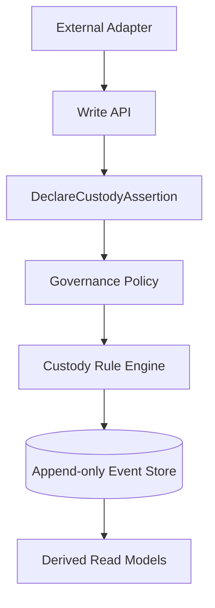

# Medical Device Custody Kernel

This repository contains an enterprise kernel for verifiable medical-device lifecycle
claims.

It is not an inventory system, ERP, dashboard, or technovigilance application. The Kernel
is an append-only protocol implementation: every write is a custody claim, and all state is
derived from the immutable log.



## Quickstart

```bash
python -m pip install -e . pytest hypothesis ruff mypy pytest-cov httpx pre-commit
python -m pytest
ruff check .
mypy kernel api sdk
python scripts/export_openapi.py
uvicorn api.main:app --reload
```

## Docker

```bash
docker compose up --build
```

## Documentation

- [Iteration 1](docs/iteration-1.md)
- [OpenAPI](docs/openapi.json)
- [Architecture decisions](docs/decisions)
- [Adapter contract](adapters/CONTRACT.md)

