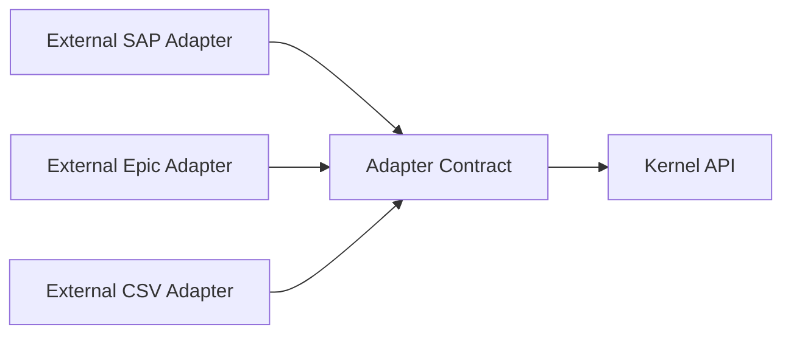

# Adapters Boundary

This package is a conformance boundary. Production adapters live in separate repositories.

```mermaid
flowchart LR
  SAP[External SAP Adapter] --> Contract[Adapter Contract]
  Epic[External Epic Adapter] --> Contract
  CSV[External CSV Adapter] --> Contract
  Contract --> Kernel[Kernel API]
```

