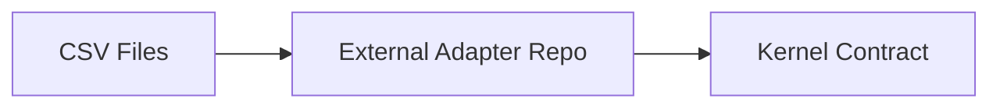

# CSV Adapter Boundary

Placeholder for CSV conformance documentation. Production CSV code is external.

```mermaid
flowchart LR
  CSV[CSV Files] --> ExternalAdapter[External Adapter Repo]
  ExternalAdapter --> Contract[Kernel Contract]
```

