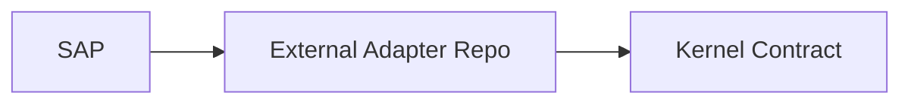

# SAP Adapter Boundary

Placeholder for SAP conformance documentation. Production SAP code is external.

```mermaid
flowchart LR
  SAP[SAP] --> ExternalAdapter[External Adapter Repo]
  ExternalAdapter --> Contract[Kernel Contract]
```

