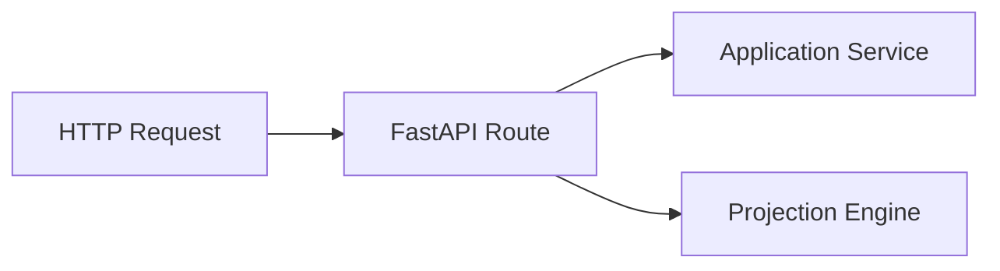

# API Package

The API is a thin transport adapter. It separates write routes from read routes and calls
application services rather than domain internals.

```mermaid
flowchart LR
  HTTP[HTTP Request] --> Route[FastAPI Route]
  Route --> AppService[Application Service]
  Route --> Projection[Projection Engine]
```

