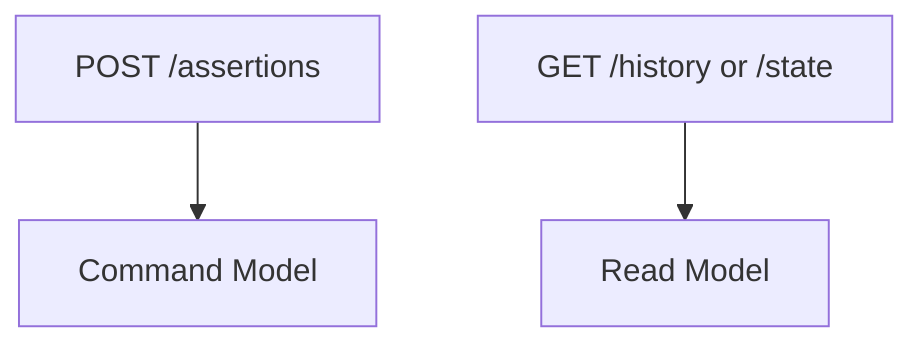

# API Routes

Routes expose command and query surfaces without mixing write and read models.

```mermaid
flowchart TB
  Write[POST /assertions] --> Command[Command Model]
  Read[GET /history or /state] --> Projection[Read Model]
```

