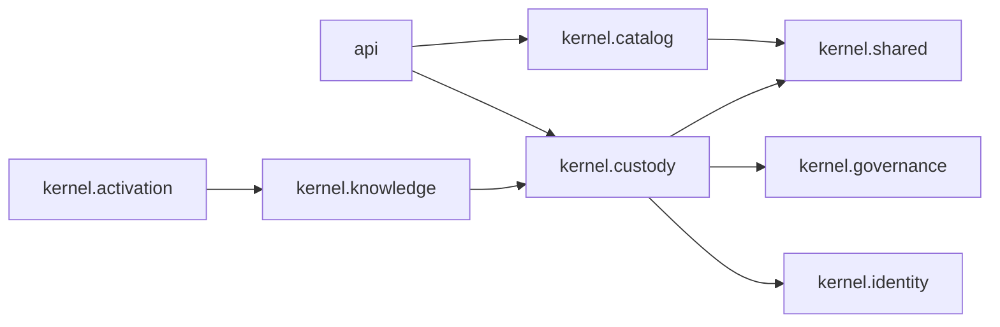

# Kernel Package

The kernel is the modular monolith core. It owns domain rules, ports, and infrastructure
adapters while preserving dependency direction toward the domain.

```mermaid
flowchart LR
  API[api] --> Custody[kernel.custody]
  API --> Catalog[kernel.catalog]
  Custody --> Identity[kernel.identity]
  Custody --> Governance[kernel.governance]
  Custody --> Shared[kernel.shared]
  Catalog --> Shared
  Activation[kernel.activation] --> Knowledge[kernel.knowledge]
  Knowledge --> Custody
```

