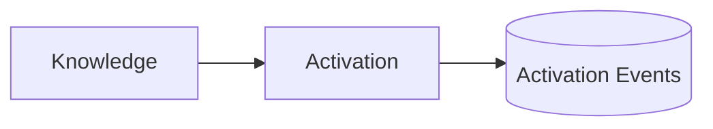

# Activation Package

Activation is reserved for field-action orchestration. It consumes Knowledge and does not
write directly into Custody.

```mermaid
flowchart LR
  Knowledge --> Activation
  Activation --> ActivationLog[(Activation Events)]
```

