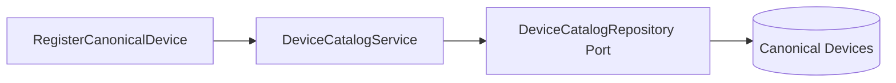

# Catalog Package

Device Catalog is the canonical regulatory identity of medical devices -- master
data, not a custody fact. It never references a physical unit's current custody
state; Custody references it by `device_id`, not the other way around.

