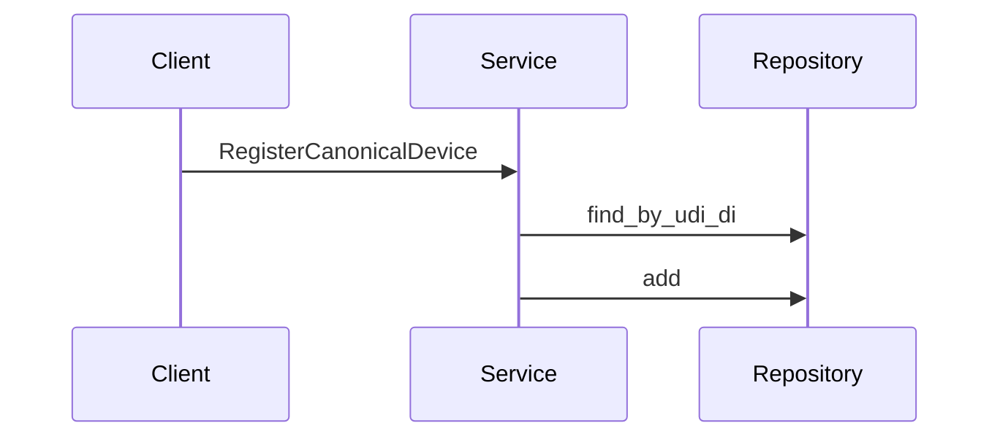

# Catalog Application

Application services orchestrate the repository port. No persistence details, no
API framework references here.

```mermaid
sequenceDiagram
  participant Client
  participant Service
  participant Repository
  Client->>Service: RegisterCanonicalDevice
  Service->>Repository: find_by_udi_di
  Service->>Repository: add
```
