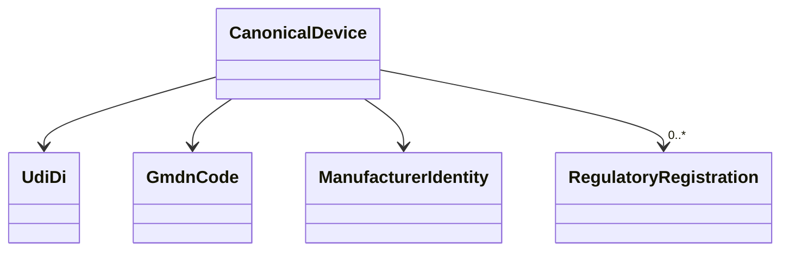

# Catalog Domain

The catalog domain contains only regulatory device-identity language: UDI-DI, GMDN,
manufacturer, risk class, registrations, packaging. No ERP names, no custody state.

```mermaid
classDiagram
  class CanonicalDevice
  class RegulatoryRegistration
  class UdiDi
  class GmdnCode
  class ManufacturerIdentity
  CanonicalDevice --> UdiDi
  CanonicalDevice --> GmdnCode
  CanonicalDevice --> ManufacturerIdentity
  CanonicalDevice --> "0..*" RegulatoryRegistration
```
