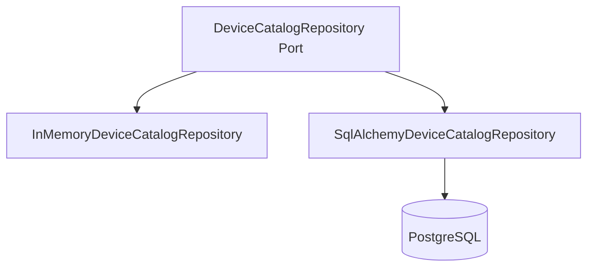

# Catalog Infrastructure

Infrastructure implements the DeviceCatalogRepository port using memory for tests
or SQLAlchemy for PostgreSQL.

```mermaid
flowchart TB
  Port[DeviceCatalogRepository Port] --> Memory[InMemoryDeviceCatalogRepository]
  Port --> SQL[SqlAlchemyDeviceCatalogRepository]
  SQL --> PostgreSQL[(PostgreSQL)]
```
