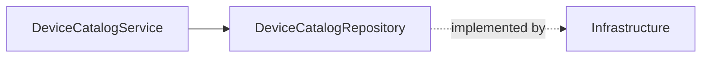

# Catalog Ports

Ports describe the storage contract required by the catalog application layer.

```mermaid
flowchart LR
  App[DeviceCatalogService] --> Repo[DeviceCatalogRepository]
  Repo -.implemented by.-> Infra[Infrastructure]
```
