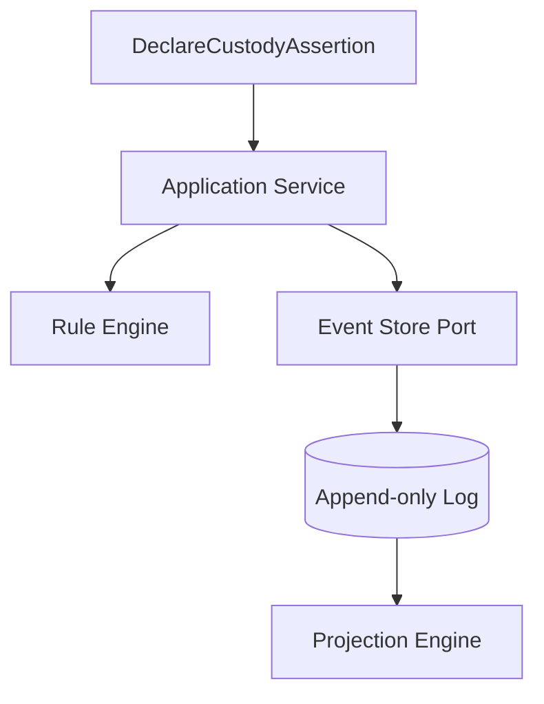

# Custody Package

Custody is the core technical domain. It accepts verifiable claims, validates them, and
appends immutable assertions to the event store.

```mermaid
flowchart TB
  Command[DeclareCustodyAssertion] --> Service[Application Service]
  Service --> Rules[Rule Engine]
  Service --> Store[Event Store Port]
  Store --> Log[(Append-only Log)]
  Log --> Projection[Projection Engine]
```

