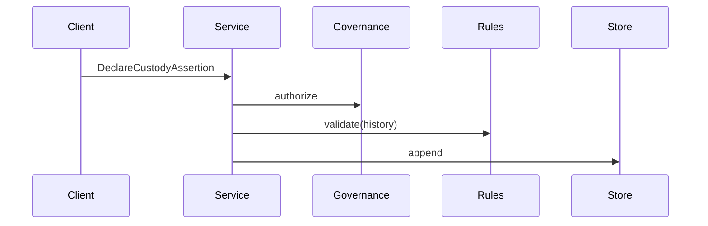

# Custody Application

Application services orchestrate domain rules and ports. They do not contain persistence
details or projection storage.

```mermaid
sequenceDiagram
  participant Client
  participant Service
  participant Governance
  participant Rules
  participant Store
  Client->>Service: DeclareCustodyAssertion
  Service->>Governance: authorize
  Service->>Rules: validate(history)
  Service->>Store: append
```

