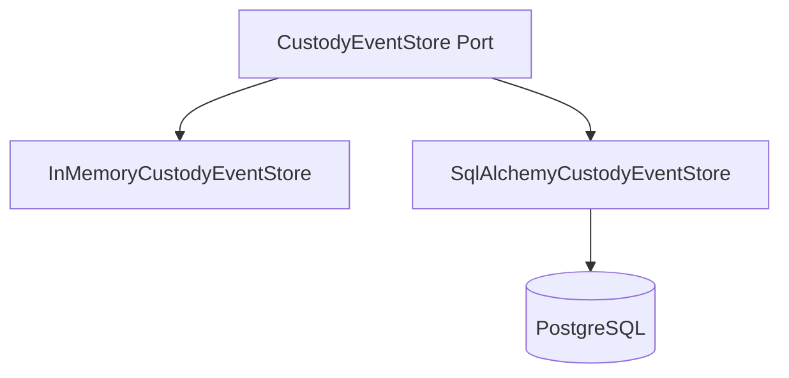

# Custody Infrastructure

Infrastructure implements ports using memory for tests or SQLAlchemy for PostgreSQL.

```mermaid
flowchart TB
  Port[CustodyEventStore Port] --> Memory[InMemoryCustodyEventStore]
  Port --> SQL[SqlAlchemyCustodyEventStore]
  SQL --> PostgreSQL[(PostgreSQL)]
```

