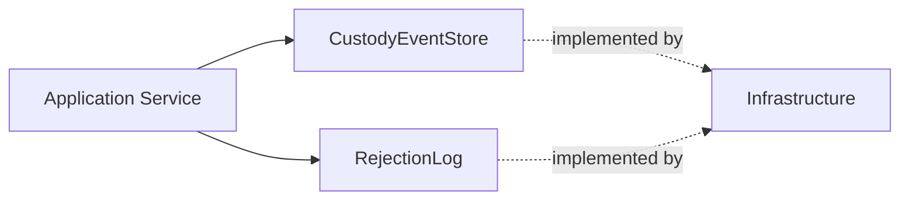

# Custody Ports

Ports describe the storage contracts required by the custody application layer.

```mermaid
flowchart LR
  App[Application Service] --> EventStore[CustodyEventStore]
  App --> RejectionLog[RejectionLog]
  EventStore -.implemented by.-> Infra[Infrastructure]
  RejectionLog -.implemented by.-> Infra
```

