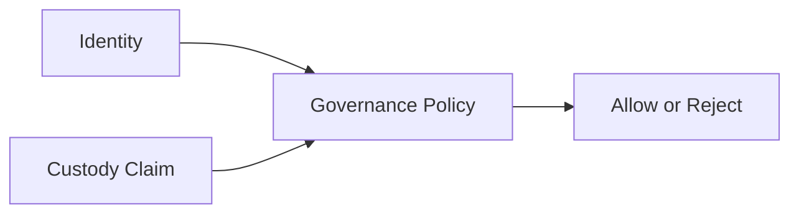

# Governance Package

Governance contains neutral platform policies that decide what a participant may do.

```mermaid
flowchart LR
  Identity[Identity] --> Policy[Governance Policy]
  Claim[Custody Claim] --> Policy
  Policy --> Decision[Allow or Reject]
```

