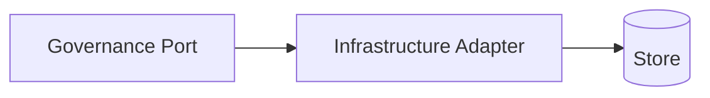

# Governance Infrastructure

Reserved for persistence and audit adapters once governance workflows are introduced.

```mermaid
flowchart LR
  Port[Governance Port] --> Adapter[Infrastructure Adapter]
  Adapter --> Store[(Store)]
```

