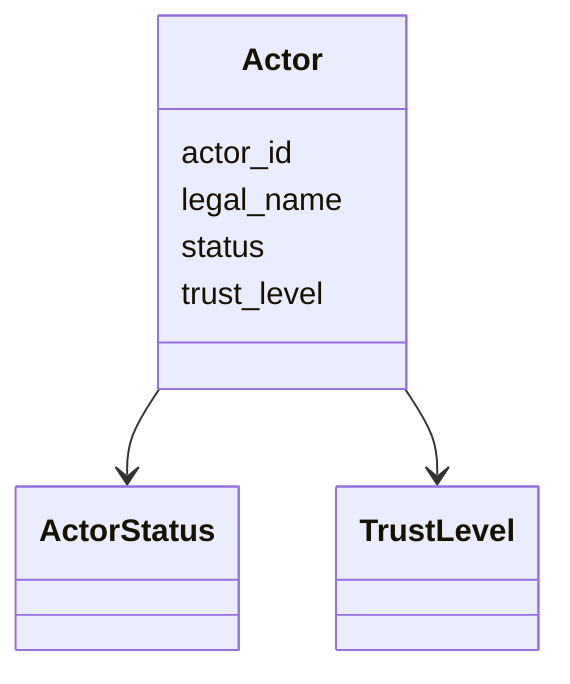

# Identity Domain

Identity domain objects describe actors without depending on persistence or API code.

```mermaid
classDiagram
  class Actor {
    actor_id
    legal_name
    status
    trust_level
  }
  class ActorStatus
  class TrustLevel
  Actor --> ActorStatus
  Actor --> TrustLevel
```

