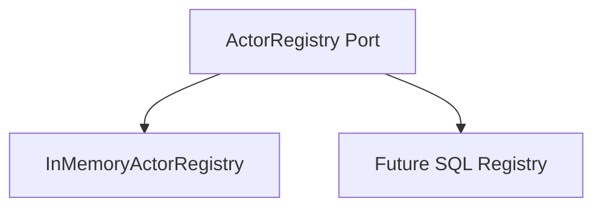

# Identity Infrastructure

Infrastructure adapters supply actor metadata to policies and application services.

```mermaid
flowchart TB
  ActorRegistry[ActorRegistry Port] --> InMemory[InMemoryActorRegistry]
  ActorRegistry --> FutureSQL[Future SQL Registry]
```

