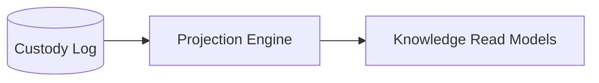

# Knowledge Package

Knowledge owns derived read models. It is rebuildable from the custody log.

```mermaid
flowchart LR
  CustodyLog[(Custody Log)] --> Projection[Projection Engine]
  Projection --> Knowledge[Knowledge Read Models]
```

