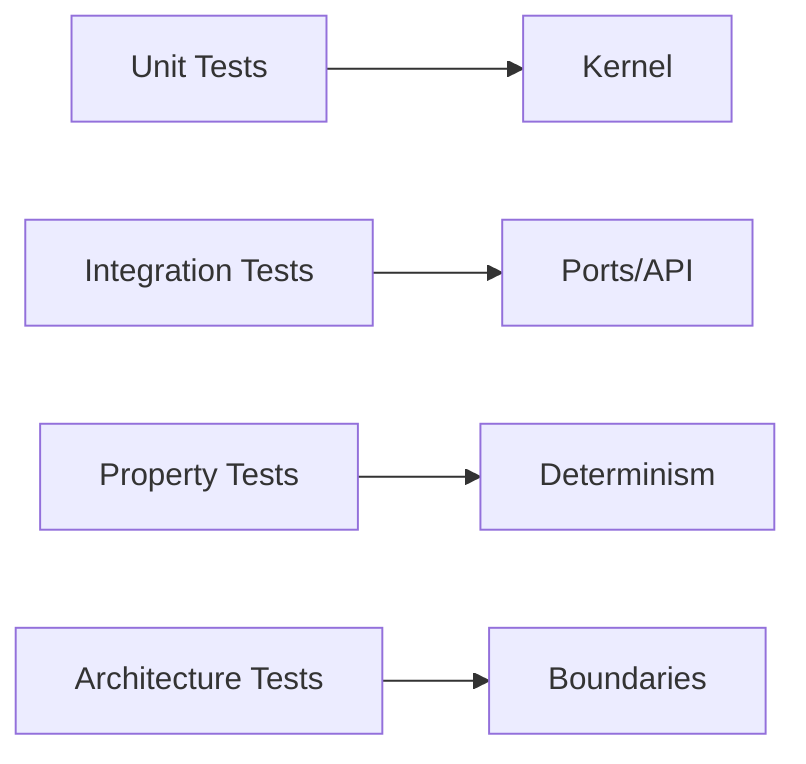

# Tests

The test suite covers domain invariants, integration contracts, property checks, API
behavior, and architecture boundaries.

```mermaid
flowchart LR
  Unit[Unit Tests] --> Kernel[Kernel]
  Integration[Integration Tests] --> Ports[Ports/API]
  Property[Property Tests] --> Determinism[Determinism]
  Architecture[Architecture Tests] --> Boundaries[Boundaries]
```

